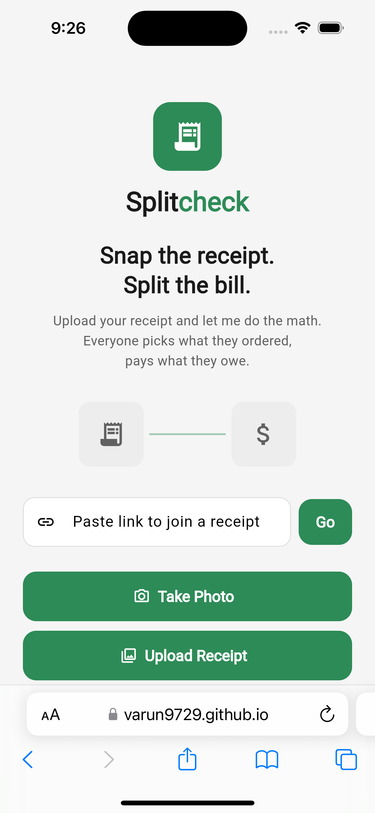
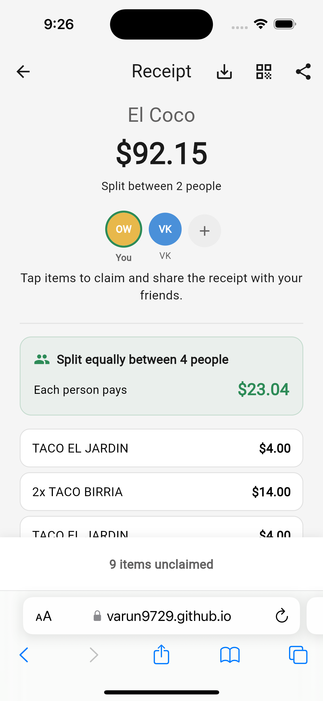

# Splitcheck

**Snap the receipt. Split the bill.**

Splitcheck is a receipt-splitting web app that uses AI to read your receipt, lets everyone pick what they ordered, and calculates exactly what each person owes — including tax and tip.

**[Try it live](https://varun9729.github.io/Splitcheck/)**

---

## Screenshots

<p align="center">
  
  &nbsp;&nbsp;
  
  &nbsp;&nbsp;
</p>

<p align="center">
  <em>Home Screen &nbsp;&nbsp;&nbsp;&nbsp;&nbsp; Receipt Split View &nbsp;&nbsp;&nbsp;&nbsp;</em>
</p>

---

## How It Works

1. **Upload a receipt** — Take a photo or upload from gallery
2. **AI reads it** — Gemini Vision extracts items, prices, tax, and total
3. **Review & edit** — Fix any items, add tip, choose split mode
4. **Share the link** — Friends open the link and claim what they ordered
5. **Pay up** — Everyone sees exactly what they owe with Venmo, PayPal, Zelle, or Splitwise

## Features

### Receipt Scanning
- AI-powered receipt parsing using Google Gemini 2.5 Flash
- Works with restaurant, bar, cafe, grocery, and retail receipts
- Handles blurry photos, thermal prints, and handwritten receipts
- Edit items, prices, and quantities after scanning

### Splitting Options
- **By items** — Friends tap to claim what they ordered
- **Split equally** — Divide the total evenly (2-99 people)
- **Per-item split** — Split individual items (e.g., shared appetizer ÷3)
- **Birthday mode** — Skip the birthday person from the split

### Payment Integration
- **Venmo** — Opens Venmo with amount pre-filled
- **PayPal** — Opens PayPal.me link
- **Zelle** — Copies amount for bank app
- **Splitwise** — Opens Splitwise app with details copied

### Real-Time
- Live updates via Firestore streams
- Multiple people can claim items simultaneously
- Settlement recalculates instantly as items are claimed

### Sharing
- Shareable link for each receipt
- QR code for in-person sharing
- Save receipt breakdown to clipboard

## Tech Stack

| Layer | Technology |
|-------|-----------|
| Frontend | Flutter (Web + iOS) |
| Backend | Firebase Cloud Functions (Gen 2, Node 22, TypeScript) |
| Database | Cloud Firestore (real-time streams) |
| Storage | Firebase Storage |
| Auth | Firebase Anonymous Auth |
| AI | Google Gemini 2.5 Flash via @google/genai |
| Hosting | GitHub Pages |

## Project Structure

```
lib/
  main.dart                          # App entry point
  app_router.dart                    # go_router navigation
  theme.dart                         # App theme (off-white + green)
  models/
    receipt_model.dart               # Receipt & ReceiptItem
    participant_model.dart           # Participant
  features/receipt/
    data/receipt_repository.dart     # Firestore CRUD
    pages/
      create_receipt_page.dart       # Home + Upload + Review
      public_receipt_page.dart       # Shared receipt + Claiming
    widgets/
      receipt_item_tile.dart         # Claimable item widget
  services/
    receipt_ai_service.dart          # Cloud Function caller
    storage_service.dart             # Firebase Storage upload
functions/src/
  index.ts                           # Gemini receipt parser
```

## Setup

### Prerequisites
- Flutter SDK 3.8+
- Node.js 22+
- Firebase CLI
- Google Cloud project with Gemini API enabled

### Installation

```bash
# Clone
git clone https://github.com/Varun9729/Splitcheck.git
cd Splitcheck

# Flutter dependencies
flutter pub get

# Firebase functions
cd functions && npm install && cd ..

# Run locally
flutter run
```

### Firebase Setup

1. Create a Firebase project
2. Enable Anonymous Auth, Firestore, Storage, and Cloud Functions
3. Add a Gemini API key as a Firebase Secret (`GEMINI_API_KEY`)
4. Deploy Firestore rules: `firebase deploy --only firestore:rules`
5. Deploy functions: `firebase deploy --only functions`

### Deploy to GitHub Pages

```bash
flutter build web --base-href "/Splitcheck/"
# Copy build/web/* to your GitHub Pages repo
```

## License

MIT
